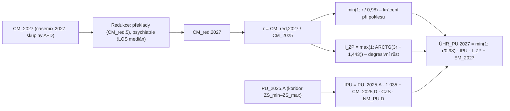

# Analýza vzorců a výpočtů návrhu úhradové vyhlášky pro rok 2027

Podklady:

- `Navrh_uhradove_vyhlasky_2027.docx` – návrh vyhlášky o stanovení hodnot bodu, výše úhrad hrazených služeb a regulačních omezení pro rok 2027 (dále „vyhláška“ nebo „ÚV 2027“),
- `Duvodova_zprava_k_navrhu_vyhlasky.docx` – důvodová zpráva (dále „DZ“).

Cílem analýzy jsou vzorce a výpočetní mechanismy. Textové, právní a procesní části vyhlášky jsou zmíněny jen tam, kde jsou pro pochopení výpočtu nutné.

Konvence zápisu: vzorce jsou přepsány lineárně, `_{...}` je dolní index, `^{...}` horní index, `Σ_{i=1}^{n}[...]` je součet, `ARCTG` je arkus tangens (výsledek v radiánech, jak je v úhradových vyhláškách zvykem). Referenční období = rok 2025, hodnocené období = rok 2027.

---

## 1. Metodika extrakce a ověření

### 1.1 Extrakce vzorců

Vzorce jsou ve vyhlášce uložené jako OMML (Office Math Markup Language, „Word Equation“). Skript `tools/extract_omml.py` (pouze standardní knihovna Pythonu) je převádí na lineární zápis:

```bash
python3 tools/extract_omml.py Navrh_uhradove_vyhlasky_2027.docx --formulas   # 108 vzorců
python3 tools/extract_omml.py Navrh_uhradove_vyhlasky_2027.docx --check      # kontrola párování závorek
python3 tools/extract_omml.py Navrh_uhradove_vyhlasky_2027.docx              # celý text vyhlášky
```

Klíčové pro správnost je zpracování elementů:

- `m:d` (delimiter) – nese vlastní znaky závorek (`{ }`, `[ ]`, `( )`) a oddělovač argumentů (`;`); bez jejich respektování vznikají zdánlivě nepárové závorky,
- `m:m` (matice) – Word ji používá jako jednosloupcovou matici pro **zalomení dlouhých vzorců do dvou řádků**; závorka otevřená v prvním řádku se uzavírá až v druhém (např. `PU_{2025,CZ-DRG,A}`, `ÚHR_{vyčl}`, `ÚHR_{PP}`, `Úhr_{pod50}`, `Úhr_amb`). Věcně jde o jeden vzorec.

Po zohlednění obou prvků má **všech 108 vzorců spárované závorky**; jedinou výjimkou jsou dvě definice po částech (`BON_{TR}`, `S`), kde je „velká složená závorka“ bez pravého protějšku záměrně (zápis případů). Dříve podezřelé vzorce byly artefaktem naivní extrakce, nikoli chybou dokumentu.

### 1.2 Numerické ověření

Všechny tři indexy typu `ARCTG` (I_ZP, I_zp_amb, IZP_CL) byly ověřeny numericky – spojitost v bodě r = 1, sklon, body zlomu a stropy (viz kap. 7). Součty koeficientů v tabulkách (příloha č. 9) a tabulka indexů centrových léků (příloha č. 15) byly porovnány s DZ.

---

## 2. Akutní lůžková péče (příloha č. 1, část A)

Úhrada akutní lůžkové péče je rozdělena podle skupin vztažených k diagnóze (DRG skupiny CZ-DRG) uvedených v příloze č. 10 do složek:

| Složka | Skupiny příl. 10 | Mechanismus |
|---|---|---|
| Paušální úhrada (PU) | A, D | individuální paušál (A) + homogenní složka na centrální sazbě (D), krácení při poklesu, degresivní index růstu |
| Vyčleněná úhrada | C, E | výkonová úhrada CZ-DRG s koeficientem centralizace |
| Případový paušál (PP) | B, F, G, H | výkonová úhrada CZ-DRG, psychiatrie (H) s koeficientem K_DZ |
| Poskytovatelé pod 50 případů | vše | čistě centrální sazba |

Tok výpočtu paušální úhrady:



### 2.1 Paušální úhrada (bod 3)

```
ÚHR_{PU,CZ-DRG,2027} = min{1 ; CM_{red,2027,CZ-DRG,AD} / (0,98 · CM_{2025,CZ-DRG,AD})} · IPU · I_{ZP} − EM_{2027,AD}
IPU = PU_{2025,CZ-DRG,A} · 1,035 + PU_{2027,CZ-DRG,D}
PU_{2027,CZ-DRG,D} = CM_{2025,CZ-DRG,D} · CZS_{CZ-DRG,2027} · NM_{PU,D}
```

| Proměnná | Význam | Hodnota / zdroj |
|---|---|---|
| CM | casemix = počet případů × relativní váha 2027 (příl. 10) | výpočet |
| 0,98 | tolerance poklesu produkce | 2 % |
| 1,035 | index růstu individuální složky (A) | +3,5 % |
| CZS_{CZ-DRG,2027} | centrální základní sazba | **84 000 Kč**; **85 000 Kč**, pokud ≥ 33 % lékařů a ≥ 15 % nelékařů u všech poskytovatelů akutní péče podstoupí očkování proti chřipce (1. 9.–31. 12. 2027) |
| NM_{PU,D} | nákladový modifikátor homogenní složky | 1,10 pro CMI > 2,7, jinak 1 |
| EM_{2027,AD} | vyžádaná extramurální péče | odečet skutečné hodnoty |

Interpretace:

- **Krácení při poklesu**: je-li r = CM_red,2027 / CM_2025 < 0,98, paušál se krátí lineárně faktorem r / 0,98 (např. r = 0,95 → 96,9 %). V pásmu 0,98–1,00 je úhrada plná.
- **Růst** se hradí přes I_ZP (kap. 2.2) – degresivně, bez tvrdého stropu.
- **Podmíněná CZS** (očkování) je nový prvek: +1 000 Kč na 1 jednotku casemixu (≈ +1,2 %) pro celý systém současně, podmínka se hodnotí celostátně (ÚZIS), nikoli po poskytovateli.

### 2.2 Index změny produkce I_ZP

```
I_{ZP} = max[1 ; ARCTG(3 · CM_{red,2027,CZ-DRG,AD} / CM_{2025,CZ-DRG,AD} − 1,443)]
```

- Konstanta 1,443 je zvolena tak, že v r = 1 je 3 − 1,443 = 1,557 ≈ tan(1), tedy ARCTG = 0,99988 ≈ 1. Index je **spojitý** v bodě 1 (odchylka 1,2·10⁻⁴).
- Počáteční sklon 3 / (1 + tan²1) = 0,876 → **první procenta nadprodukce se hradí zhruba na 88 %**, s rostoucí produkcí klesá (10 % → 7,7 %; 20 % → 13,7 %; 50 % → 25,5 %).
- Teoretická asymptota π/2 ≈ 1,571.

### 2.3 Referenční paušál PU_2025 a koridor základních sazeb (bod 3.1)

```
PU_{2025,CZ-DRG,A} = min{ CM_{2025,A-D} · ZS_{max,2025,PU} ;
                          max[ CM_{2025,A-D} · ZS_{min,2025,PU} ;
                               ÚHR_{PU,CZ-DRG,2025} + ÚHR^{2025}_{EU,A-D} + ÚHR^{2025}_{ISU,A-D} + EM_{2025,A-D} ] }
                     · CM_{2025,A} / CM_{2025,A-D}

ZS_{max,2025,PU} = 0,75 · MAX_{2025,PU} + 0,25 · IZS_{2025,PU}
IZS_{2025,PU}    = (ÚHR_{PU,2025} + ÚHR_{EU} + ÚHR_{ISU} + EM_{2025}) / CM_{2025,A-D}
```

| Parametr | Hodnota |
|---|---|
| MAX_{2025,PU} | 110 000 Kč |
| ZS_{min,2025,PU} | 77 500 Kč (referenční síť dle § 41a zákona + urgentní příjem), 75 000 Kč (urgentní příjem, mimo síť), 70 000 Kč (ostatní) |

Interpretace: skutečná referenční úhrada za skupiny A–D se přepočte na individuální sazbu IZS a **vtěsná do koridoru** ⟨ZS_min ; ZS_max⟩. Horní hranice není pevná, ale vážený průměr stropu 110 000 a vlastní sazby (váhy 3 : 1) – např. IZS = 80 000 → ZS_max = 102 500; IZS = 120 000 → ZS_max = 112 500 (sazby nad stropem se sráží jen o čtvrtinu přesahu, nikoli na strop). Dolní hranice je odstupňovaná a motivuje k provozu urgentního příjmu a účasti v referenční síti. Podíl CM_A / CM_{A-D} pak z koridorem upravené úhrady vyčlení část připadající na skupinu A (skupina D se hradí centrální sazbou, viz IPU).

### 2.4 Redukovaný casemix (bod 3.2)

Překlady do jiného zařízení (index „5“ = kód ukončení léčení 5; PPR = počet takto ukončených případů skupin A a D):

```
CM_{red,2027} = CM_{1,2027} + CM_{red,5}
CM_{red,5} = Σ_i Σ_j max(CM_{2027,JPL,5,ij} ; CM_{2027,CZ-DRG,5,ij})
             · min[1 ; X · (PPR_{2025,5} / PPR_{2027,5}) · (PP_{2027} / PP_{2025})]
```

Uplatní se, jen pokud podíl přeložených případů překročí 7,5 % (`PPR_{5} ≤ 0,075 · PP` → bez redukce). Roste-li podíl překladů rychleji než X-násobek, casemix těchto případů se úměrně krátí.

Psychiatrie (skupina H):

```
CM_{red,2027,H} = CM_{2027,H} · min{1 ; X · max(14 ; LOS^{median}_{2025,H}) / LOS^{median}_{2027,H}}
```

Zkrátí-li poskytovatel medián ošetřovací doby o více než (X − 1), casemix se krátí; floor 14 dní chrání poskytovatele s již krátkou dobou hospitalizace (u nových poskytovatelů se použije LOS_2025 = 18).

| X | Podmínka (příl. 9 bod 1 – koeficient poměru pojištěnců ZP v okrese) |
|---|---|
| 1,10 | koeficient > 0,1 |
| 1,15 | koeficient ≤ 0,1 |

Menší pojišťovny v okrese tak mají o 5 p. b. větší toleranci (ochrana před náhodnou variabilitou malých počtů).

Casemix po jednotlivých případech se počítá jako `max(CM_JPL ; CM_CZ-DRG)`, tj. u případů s drahými položkami (JPL – jednotlivé položky) se použije vyšší z obou ocenění.

### 2.5 Vyčleněná úhrada (bod 4, skupiny C, E)

```
ÚHR_{vyčl,CZ-DRG,2027} = Σ_i Σ_j max(CM_{CE,nepovinnéJPL,ij} ; CM_{2027,CZ-DRG,CE,ij} · NM_{CE}) · CZS_{CZ-DRG,2027} · KC_{CE,ij}
                        + CM_{CE,povinnéJPL} · CZS_{CZ-DRG,2027}
                        + BON_{mRS-90} − EM_{2027,CE}

BON_{mRS-90} = 0,05 · CZS_{CZ-DRG,2027} · CM_{CMP,CZ-DRG,2027}
CMI = CM_{2025,CZ-DRG,všechnyZP} / PP_{drg,2025,všechnyZP}
```

| Parametr | Hodnota |
|---|---|
| NM_{CE} | **1,25** pro CMI > 2,7 (CMI za všechny pojišťovny dohromady); **1,20** pro člena referenční sítě s ≥ 6 statusy centra vysoce specializované péče; **1,10** pro poskytovatele se statusem traumacentra a ≥ 4 dalšími statusy; **1,00** ostatní |
| KC_{CE,ij} | koeficient centralizace z příl. 10 části C, E – liší se podle toho, zda má poskytovatel statut centra vysoce specializované péče |
| BON_{mRS-90} | +5 % z hodnoty casemixu iktových případů (DRG 01-K10-01 až 01-K10-06), pokud poskytovatel u ≥ 90 % těchto pacientů vykáže kód mRS při propuštění (U55.20–U55.26) i po 90 dnech |

„Povinné JPL“ (drahé položky) se hradí vždy podle položek; u „nepovinných JPL“ platí `max(JPL ; DRG × NM)`.

### 2.6 Případový paušál (bod 5, skupiny B, F, G, H)

```
ÚHR_{PP,CZ-DRG,2027} = Σ_i Σ_j max(CM_{BFG,nepovinnéJPL,ij} ; CM_{2027,CZ-DRG,BFG,ij} · NM_{PP}) · CZS_{CZ-DRG,2027} · KC_{BFG,ij}
                      + CZS_{CZ-DRG,2027} · (CM_{BFG,povinnéJPL} + 0,5 · CM_{děti} + CM_{red,2027,CZ-DRG,H} · K_{DZ})
                      − EM_{2027,BFGH}
```

| Parametr | Hodnota |
|---|---|
| NM_{PP} | 1,10 pro CMI > 2,7, jinak 1 |
| 0,5 · CM_{děti} | +50 % za dětské (< 18 let) onkologické případy skupin příl. 10 části J u komplexních onkologických center |
| K_{DZ} | koeficient reformy psychiatrické péče (níže) |

Koeficient duševního zdraví:

```
K_{DZ} = 1 + KP_{krit} + K_{CDZ} + K_{DS} + K_{TransNLP}
K_{TransNLP} = 0,10 · sqrt(0,25 · PLNLP_{2018} / PLNLP_{2030})
               · min[1,1 ; (PLNLP_{2018} − PLNLP_{2027}) / (0,85 · (PLNLP_{2018} − PLNLP_{2030}))]
```

| Člen | Hodnoty | Význam |
|---|---|---|
| KP_{krit} | **+0,04** při splnění všech kritérií bodu 5.3, jinak **−0,06** | asymetrická sankce/bonus za kvalitu akutní psychiatrické péče |
| K_{CDZ} | 0,03 (odb. 350/360/370/922), 0,04 (odb. 355), nejvyšší splněná | provoz centra duševního zdraví |
| K_{DS} | 0,03 (výkon 00043), 0,02 (výkony 00041/00042) | denní stacionář |
| K_{TransNLP} | ≤ 0,10 · sqrt(0,25 · PLNLP_2018 / PLNLP_2030) · 1,1 | tempo redukce lůžek následné psychiatrické péče oproti plánu 2030; při plánu 60 % lůžek roku 2018 je maximum ≈ +0,071 |

Rozsah K_DZ je tedy přibližně 0,94 až 1,22.

### 2.7 Poskytovatelé s méně než 50 případy (bod 6)

```
Úhr_{pod50,CZ-DRG,2027} = (CM_{2027,AD} + CM_{2027,H} · K_{DZ}) · ZS_{pod50}
                         + Σ_i Σ_j max(CM_{BCEFG,nepovinnéJPL,ij} · CZS ; CM_{2027,BCEFG,ij} · ZS_{pod50}) · KC_{BCEFG,ij}
                         + CM_{BCEFG,povinnéJPL} · CZS − EM_{pod50,2027}
ZS_{pod50} = CZS_{CZ-DRG,2027} · NM_{PP}
```

Bez individuálního paušálu a bez indexu I_ZP – čistě výkonová úhrada na centrální sazbě.

---

## 3. Ambulantní složka nemocnic (příloha č. 1, body 7.x)

### 3.1 Struktura

```
Úhr_amb_{2027} = Úhr_amb_{2027,lab} + Úhr_amb_{2027,radost}      (lab = laboratoře; radost = radiodiagnostika + ostatní ambulance)

Úhr_amb_{2027,lab}    = min{ min[1 ; HP_{2027,lab} / HP_{2025,lab}] · KN^{lab}_{amb} · Úhr_amb_{ref} · HP_{ref,lab} / HP^{red}_{ref} ;
                             HP_{2027,lab} }
Úhr_amb_{2027,radost} = min{ min[1 ; HP_{2027,radost} / HP_{2025,radost}] · I_{zp_amb} · KN^{radost}_{amb} · Úhr_amb_{ref} · HP_{ref,radost} / HP^{red}_{ref} ;
                             HP_{2027,radost} }

Úhr_amb_{ref} = (HP^{red}_{ref} / HP_{ref}) · min[HP_{ref} ; 0,5 · Úhr_amb_{2025} + 0,5 · HP_{ref}]
```

(HP = Hodnota_péče.)

Hodnota péče = body × hodnota bodu 2027 + korunové položky, násobeno bonifikačním koeficientem:

```
HP_{t,seg} = (Σ_i PB_{i,t,seg} · HB_{i,2027,seg} + KP_{t,seg}) · BON_{seg}
BON_{lab} = 1 + BON^{lab}_{prodloužený_režim} + BON_{akreditace}
BON_{ost} = 1 + BON_{16/7,ost} + BON_{objednávkový_systém}
BON_{rad} = 1 + BON^{rad}_{prodloužený_režim} + BON_{sdílení_dat}
```

Referenční i hodnocená péče se oceňuje **hodnotami bodu 2027** – porovnává se tedy objem, nikoli cena.

### 3.2 Koeficienty navýšení

```
KN^{lab}_{amb}    = 1,045 + změnaBON_{lab}
KN^{ost}_{amb}    = 1,07  + změnaBON_{16/7,ost} + změnaBON_{objednávkový_systém}
KN^{rad}_{amb}    = 1,05  + změnaBON^{rad}_{prodloužený_režim} + změnaBON_{sdílení_dat}
KN^{radost}_{amb} = (KN^{rad} · HP_{ref,rad} + KN^{ost} · HP_{ref,ost}) / HP_{ref,radost}     (vážený průměr)
```

Základní růst: laboratoře +4,5 %, radiodiagnostika +5 %, ostatní ambulance +7 %; ke každému se přičítá změna bonifikací mezi referenčním a hodnoceným obdobím (nově splněná bonifikace zvyšuje KN, ztracená snižuje).

### 3.3 Logika mechanismu

1. **Narovnání referenční úhrady**: `Úhr_amb_ref` posouvá historickou úhradu z 50 % k hodnotě péče (`0,5 · Úhr_2025 + 0,5 · HP_ref`), nejvýše však na hodnotu péče. Poskytovatelé s nízkými historickými paušály tak dostávají skokové přiblížení k výkonovému ocenění; poskytovatelé nad hodnotou péče jsou sraženi na ni.
2. **Rozdělení na segmenty** poměrem hodnot péče (`HP_{ref,seg} / HP^{red}_{ref}`).
3. **Pokles produkce** se přenáší 1 : 1 (`min[1; HP_2027/HP_2025]`).
4. **Růst produkce** se u laboratoří nehradí vůbec (jen KN), u radiodiagnostiky a ostatních ambulancí přes `I_zp_amb` (kap. 3.4).
5. **Strop** = skutečná hodnota péče 2027: nikdy se nezaplatí víc než výkonové ocenění vykázané péče.

### 3.4 Index změny produkce ambulancí

```
I_{zp_amb} = max{1 ; 1 + IZ_{GAUP} · [ARCTG(2,6 · HP_{2027,radost} / HP_{2025,radost} − 1,069) − 1]}
IZ_{GAUP}  = max[0 ; min(1 ; (GAUP_{2027} / GAUP_{2025} − 1) / (0,5 · (HP_{2027,radost} / HP_{2025,radost} − 1)))]
```

(Při HP_2027/HP_2025 = 1 se IZ_GAUP nepoužije.)

- `IZ_GAUP` váže uznání nárůstu produkce na nárůst počtu **globálních unikátních ambulantních pojištěnců**: nárůst se uzná v plné výši, jen pokud počet pojištěnců roste alespoň **polovičním tempem** oproti hodnotě péče; jinak poměrně (růst objemu na stejných pacientech se nehradí).
- **Nález**: v r = 1 je 2,6 − 1,069 = 1,531, ARCTG(1,531) = 0,9922 < 1. Index se od hodnoty 1 „odlepí“ až při r ≈ **1,0102**, tj. první ≈ 1 % růstu není hrazeno. Ostatní dva ARCTG indexy ve vyhlášce (I_ZP, IZP_CL) jsou v r = 1 spojité (konstanta = 3 − tan 1, resp. 2,75 − tan 1). Pro spojitost by konstanta musela být 2,6 − tan(1) ≈ 1,0426. Doporučeno ověřit, zda je 1 % pásmo záměr.

---

## 4. Urgentní příjmy, LPS, ERN, následná péče a další (příloha č. 1, body 8+ a další přílohy)

### 4.1 Urgentní příjem a lékařská pohotovostní služba

```
Úhr_{Urg,ZZS,LPS,2027} = Úhrada_{PříjemZZS,2027} + Paušál_{LPS,2027} + Úhrada_{Urg,2027}
Paušál_{LPS,2027}  = K · (Paušál_{LPS,dospělí} + Paušál_{LPS,děti})
Úhrada_{Urg,2027}  = K · (Paušál_{Urg,2027} + CKP^{paušální}_{bonifikace,2027}) + Výkony_{Urg,2027}
Výkony_{Urg,2027}  = min[0,6 · (PB_{urg} + PB_{LPS} + PB_{KV} + KP_{2027}) ; Limit_{urg,2027}]
```

K je podíl pojišťovny (koeficient podle příl. 9); výkonová složka urgentního příjmu se hradí ve výši **60 %** bodového ocenění do limitu, zbytek pokrývá paušál a bonifikace (CKP – celková kapacita/personální kritéria).

### 4.2 Evropské referenční sítě (ERN)

```
ERN_{2027} = K · Σ_{i=1}^{n}[8 500 000 + 1 500 000 · n · UOP_{i,2027,99976} / UOP_{2027,99976}] + 126 · UOP_{2027,99976}
```

Za každou síť i: fixní 8,5 mil. Kč + z celkového balíku 1,5 mil. Kč × n rozdělený poměrem unikátních pacientů (UOP, výkon 99976); plus 126 Kč na každého unikátního pacienta. Celkem tedy Σ = n · 10 mil. Kč · K + 126 · UOP.

### 4.3 Následná a dlouhodobá lůžková péče

```
PS_{OD,HO} = (ZKN + KN) · PS_{OD,2026}            (paušální sazba za ošetřovací den = sazba 2026 × (základní + bonifikační navýšení))
BON_{Geri,2027} = min{0,1 ; 10 · PočetGeriatrů / PočetLůžek_{OD24}}
0,35 · K_{TransNLP} + BON_{Akreditace}           (navýšení KN pro OD 00021 a 00026 u poskytovatelů se schváleným transformačním plánem)
```

- ZKN = **1,035** pro OD 00005, 00024, 00030, 00037; **1,02** pro ostatní OD. KN je součet bonifikací za personální a technické vybavení (počet lůžek na pokoji ≤ 2,5, ≥ 75 % elektricky polohovatelných lůžek atd.).
- Geriatrická bonifikace: 1 % za každého geriatra na 100 lůžek, strop 10 % (tj. při ≥ 1 geriatr / 100 lůžek).
- Psychiatrická následná péče přebírá 35 % koeficientu K_TransNLP z akutní péče (kap. 2.6) + BON_Akreditace 0,015.

### 4.4 Transplantační program – bonifikace

```
BON_{TR} = 0                                  pro S = 0
         = N_{min} + S · (N_{max} − N_{min})   pro S > 0
S        = 0                                  pro K_{TR} < LT
         = min(1 ; (K_{TR} − LT) / (HT − LT))  pro K_{TR} ≥ LT
K_{TR}   = (2 · PP_{TXP} + PP_{TXO} + 2 · PP_{WLP} + PP_{WLO}) / PP_{CELK}
```

Po částech lineární bonifikace podle podílu transplantačních a čekacích případů (ledviny/pankreas váha 2, ostatní 1) mezi dolním (LT) a horním (HT) prahem.

### 4.5 Praktičtí lékaři – týmová praxe, POCUS, telemedicína

```
Úhr_{týmová_praxe} = KPP_{okres} × Úv_{+} × 10 800 Kč
n_{POCUS} = 250/12 · PM_{POCUS,2027} · KPP_{okres}        (měsíční limit počtu výkonů; 5 000 Kč · PM · KPP na vybavení)
n_{TS}    = 200/12 · PM_{TS,2027} · KPP_{okres},  MÚ_{TS} = 25 000 Kč · KPP_{okres}
```

Limity se škálují počtem měsíců (PM) a podílem pojišťovny v okrese (KPP).

### 4.6 Ambulantní specialisté – PURO a regulace hodnoty bodu

Předběžná úhrada na unikátního ošetřeného pojištěnce (PURO):

```
PURO_{O} = max{ UHR_{ref} / POP_{ref} ; (PB_{ref} · HB_{min} + ZUM_{ROo} + ZULP_{ROo}) / POP_{ref} }
Úhrada   = (1,06 + KN) · POP_{zpoZ} · PURO_{O} + max[(1,06 + KN) · PURO_{O} · POP_{zpoMh} ; UHR_{Mh} − UHR_{Mr}]
```

Základní růst **6 % + KN** na unikátního pojištěnce; druhý člen ošetřuje pojištěnce ošetřené v hodnoceném, ale ne v referenčním období.

Regulace výsledné hodnoty bodu (variabilní + fixní složka):

```
VS = (HB − FS) · min{1 ; KN · (PB_{ref} / UOP_{ref}) / (PB_{ho} / UOP_{ho})}
```

Rostou-li body na unikátního pojištěnce rychleji než KN, krátí se jen variabilní složka; fixní složka FS je garantována.

Noví poskytovatelé a poskytovatelé bez reference:

```
HB_{min,a}  = Σ_i (PB_{i,ref} · HB_{i,ref}) / PB_{ref,a} · 0,91          (91 % referenční průměrné hodnoty bodu)
PURO_{icznové,a} = HB_{min,a} / HB_{skut,a} · PURO_{icz}
HB_{skut,a} = UHR_{ref,a} / PB_{ref,a}
```

Domácí paliativní péče (odb. 926) – limit úhrady výkonů 80090/80091 (hodnota bodu 1,23 Kč):

```
min{ (POP_{dosp} · 30 + POP_{dět} · 180) · PB_{80091} · HB ; Body_{ho} · HB }
```

tj. nejvýše 30 dnů péče na dospělého a 180 dnů na dětského unikátního pojištěnce.

Zvláštní ambulantní péče v pobytových zařízeních sociálních služeb (odb. 913) – limit na unikátní ošetřený měsíc:

```
max{ PMUP_{ref} · Σ_j PUM_{ho,j} · 1,05 · KN ; PB_{ho} · HB_{min} + KP_{ho} }
PMUP_{ref} = Uhr_{ref} / Σ_i PUM_{ref,i}
```

(PUM = počet kalendářních měsíců, v nichž byla unikátnímu pojištěnci poskytnuta péče; referenční úhrada na měsíc × 1,05 × KN.)

Fyzioterapie (odb. 902) – bonifikace za včasné zahájení péče po hospitalizaci nebo jednodenní péči:

```
400 + 400 · min[1 ; (14 − počet dnů) / 7]     Kč za unikátního pojištěnce
```

Plných 800 Kč při zahájení do 7 dnů, 400 Kč při 14 dnech, lineárně mezi; po 14 dnech bez bonifikace.

### 4.7 Jednodenní péče

```
Úhrada_{JP,2027} = Σ_i Úhrada_{JP,i} · Počet_výkonů_{JP,i} − EM_{JP}
```

Pevná úhrada za výkon jednodenní péče podle přílohy, snížená o vyžádanou extramurální péči.

---

## 5. Centrové léčivé přípravky (příloha č. 1 bod 1.4, příloha č. 15)

```
ÚHR_{CL,2027} = min{ Σ_{i=a}^{q} Produkce_{i,CL,2025} · INU_{i} · ICS_{i} ;
                     Σ_{i=a}^{q} Produkce_{i,CL,2027} · ICS_{i} } · IZP_{CL}

IZP_{CL} = min{1,075 ; max[1 ; ARCTG(2,75 · Σ Produkce_{2027} · ICS / Σ Produkce_{2025} · INU · ICS − 1,1926)]}
```

Mechanismus (potvrzeno DZ): pro každou diagnostickou skupinu i se referenční produkce navýší indexem INU (očekávaný růst) a sníží indexem cenové slevy ICS (rozdíl mezi pořizovací a vykazovací cenou). Hradí se **nižší** z (referenční produkce × INU × ICS) a (skutečná produkce × ICS), násobeno degresivním indexem IZP_CL se stropem **+7,5 %** (dosaženo při r ≈ 1,106).

Tabulka indexů (příl. 15, bod 5):

| Skupina | INU | ICS | DZ „Index ÚV 2027“ |
|---|---|---|---|
| Dermatologie | 1,36 | 0,93 | 93 % |
| Dýchací soustava 1 | 1,44 | 0,98 | 98 % |
| Dýchací soustava 2 | 1,37 | 0,87 | 87 % |
| Endokrinologie | 1,28 | 1,00 | 100 % |
| Hematoonkologie | 1,20 | 0,95 | 95 % |
| Imunitní systém | 1,20 | 0,98 | 98 % |
| Infekce | 1,04 | 0,98 | 98 % |
| Metabolické vady | 1,35 | 0,98 | 98 % |
| Neurologie 1 | 1,35 | 0,98 | 98 % |
| Neurologie 2 | 1,08 | 0,95 | 95 % |
| Oběhový systém | 1,36 | 0,97 | 97 % |
| Oftalmologie | 1,15 | 0,98 | 98 % |
| Onkologie – solidní nádory | 1,25 | 0,97 | 97 % |
| **Revmatologie** | 1,14 | **0,90** | **88 %** – rozpor |
| Trávicí soustava | 1,16 | 0,92 | 92 % |
| Vyjmuté z Klasifikace | 1,25 | 1,00 | 100 % |
| Ostatní | 1,40 | 0,97 | 97 % |

---

## 6. Přehled parametrů a jejich ekonomický význam

| Parametr | Hodnota | Kde | Význam |
|---|---|---|---|
| CZS_{CZ-DRG,2027} | 84 000 / 85 000 Kč | příl. 1 bod 3 | centrální sazba, +1 000 Kč podmíněno proočkovaností |
| Růst individuálního paušálu | 1,035 | IPU | +3,5 % |
| Tolerance poklesu paušálu | 0,98 | ÚHR_PU | 2 % |
| MAX / ZS_min | 110 000 / 77 500–70 000 Kč | koridor ZS | sbližování sazeb |
| NM_{PU,D}, NM_{PP} | 1,10 (CMI > 2,7) | PU, PP | prémie za složitost |
| NM_{CE} | 1,25 / 1,20 / 1,10 / 1,00 | vyčleněná úhrada | prémie za složitost a centrové statusy |
| X | 1,10 / 1,15 | redukce CM | tolerance změn struktury |
| BON_{mRS-90} | 5 % | ikty | bonifikace kvality |
| CM_{děti} | +50 % | dětská onkologie | příplatek |
| K_{DZ} | ≈ 0,94–1,22 | psychiatrie | reforma |
| KN_amb (lab / rad / ost) | 1,045 / 1,05 / 1,07 | ambulance nemocnic | růst |
| Narovnání Úhr_amb_ref | 50 % | ambulance nemocnic | přiblížení k výkonu |
| Růst ambulantních specialistů | 1,06 + KN | PURO | růst |
| HB_min pro nové poskytovatele | 91 % | PURO | zamezení výhody nových ICZ |
| Výkony urgentního příjmu | 60 % | Urg | podíl výkonové složky |
| Strop IZP_CL | 1,075 | centrové léky | max +7,5 % za nadprodukci |
| BON_Geri | max 10 % | následná péče | 1 geriatr / 100 lůžek |

---

## 7. Numerické ověření indexů ARCTG

| r = hodnocené / referenční | I_ZP (lůžka) | I_zp_amb (IZ_GAUP = 1) | IZP_CL (centrové léky) |
|---|---|---|---|
| 0,90 | 1,0000 | 1,0000 | 1,0000 |
| 0,98 | 1,0000 | 1,0000 | 1,0000 |
| 1,00 | 1,0000 | 1,0000 | 1,0000 |
| 1,01 | 1,0085 | **1,0000** | 1,0079 |
| 1,02 | 1,0169 | 1,0074 | 1,0157 |
| 1,05 | 1,0409 | 1,0289 | 1,0378 |
| 1,10 | 1,0768 | 1,0616 | 1,0712 |
| 1,15 | 1,1085 | 1,0908 | 1,0750 (strop) |
| 1,20 | 1,1367 | 1,1171 | 1,0750 |
| 1,50 | 1,2546 | 1,2312 | 1,0750 |

Vlastnosti:

| Index | Hodnota ARCTG v r = 1 | Sklon v r = 1 | Bod „odlepení“ od 1 | Strop |
|---|---|---|---|---|
| I_ZP = max[1; ARCTG(3r − 1,443)] | 0,99988 | 0,876 | r = 1,0000 | π/2 ≈ 1,571 (teoretický) |
| I_zp_amb = 1 + [ARCTG(2,6r − 1,069) − 1] | 0,99220 | 0,778 | **r = 1,0102** | π/2 |
| IZP_CL = min{1,075; max[1; ARCTG(2,75r − 1,1926)]} | 1,00000 | 0,803 | r = 1,0000 | 1,075 při r ≈ 1,106 |

Pod hodnotou r = 1 jsou všechny tři indexy rovny 1 (pokles produkce řeší jiné členy vzorců: `min(1; r/0,98)` u paušálu, `min[1; HP_2027/HP_2025]` u ambulancí, `min{ref; skutečnost}` u centrových léků).

---

## 8. Nálezy k opravě nebo ověření

Věcné (ovlivňují výklad nebo výpočet):

1. **ÚHR_{CL,2027}** (příl. 15) – ve druhé sumě je `ICS_i` typograficky vysazeno **mimo** znak součtu: `Σ_{i=a}^{q}[Produkce_{i,CL,2027} ·] ICS_i`. Věcně je nepochybné, že má být `Σ[Produkce_i · ICS_i]`; pro právní text je nutné opravit. Zároveň horní mez sumy je `q` v ÚHR_CL, ale `r` v IZP_CL – sjednotit (skupin je a) až q), tj. 17).
2. **HB_{min,a}** (příl. 3, noví poskytovatelé) – část součinu je vysazena mimo součet: `Σ_{i=1}^{n}[(PB_{i,ref}] · HB_{i,ref}) / PB_{ref,a} · 0,91`. Správně `Σ[PB_{i,ref} · HB_{i,ref}] / PB_{ref,a} · 0,91`.
3. **I_{zp_amb}** – nespojitost v r = 1 (ARCTG = 0,992); nárůst hodnoty péče do ≈ 1,02 % není hrazen. Pokud jde o záměr (tolerance), je vhodné jej zmínit v DZ; pokud nikoli, konstanta má být ≈ 1,0426.
4. **Revmatologie** – index cenové slevy ve vyhlášce **0,90**, v tabulce DZ („Index ÚV 2027“) **88 %**. Ostatních 16 skupin se shoduje. Ověřit, která hodnota je správná (rozdíl 2 p. b. z objemu revmatologické centrové léčby).

Formální (nemění výpočet):

5. Nekonzistentní umístění roku v indexech: `ÚHR^{2025}_{EU,A-D}`, `ÚHR^{2025}_{ISU,A-D}` (horní index) vs. `ÚHR_{PU,CZ-DRG,2025}`, `EM_{2025,A-D}` (dolní index).
6. `K_{DZ}_{}` – prázdný dolní index ve vzorci K_DZ; `KP_{krit}` vs. `KP_{Krit}` v definici.
7. `CM_{ red,2027,...}` – mezera navíc v indexu (několik výskytů); `Hodnota_péče_{2025, lab}` vs. `Hodnota_péče_{2025,lab}` – nejednotné mezery, které mohou komplikovat strojové zpracování.
8. Ve vzorci K_{TransNLP} je za `min[...]` neviditelný znak U+2061 (function application) – neškodný, ale zbytečný.
9. Dvě definice po částech (`BON_{TR}`, `S`) používají zarovnávací znak `&` a jednostrannou složenou závorku – při konverzi do jiných formátů (PDF/Sbírka) ověřit sazbu.

---

## 9. Shrnutí

Návrh ÚV 2027 zachovává architekturu z roku 2026 (paušál + vyčleněná úhrada + případový paušál na CZ-DRG; ambulantní složka nemocnic narovnávaná k hodnotě péče; PURO u ambulantních specialistů; centrové léky s indexy cenové slevy) a mění především parametry:

- centrální základní sazba 84 000 Kč s podmíněným navýšením na 85 000 Kč za proočkovanost personálu,
- růst individuálního paušálu 3,5 %, ambulancí nemocnic 4,5–7 %, ambulantních specialistů 6 % + KN,
- koridor základních sazeb 70 000–77 500 Kč (dolní) / 0,75 · 110 000 + 0,25 · IZS (horní),
- degresivní ARCTG indexy pro nadprodukci ve třech segmentech (lůžka bez stropu, centrové léky strop 7,5 %, ambulance vázané na růst počtu unikátních pojištěnců),
- bonifikace kvality (mRS-90 u iktů, akreditace, ordinační doba, sdílení dat, geriatři) a pokračující sankčně-bonifikační schéma reformy psychiatrie (K_DZ).

Vzorce jsou po korektní extrakci konzistentní a spočitatelné; k opravě jsou dvě typografické vady v sazbě součtů, jedna nekonzistence konstanty (I_zp_amb) a jeden číselný rozpor mezi vyhláškou a důvodovou zprávou (revmatologie).
